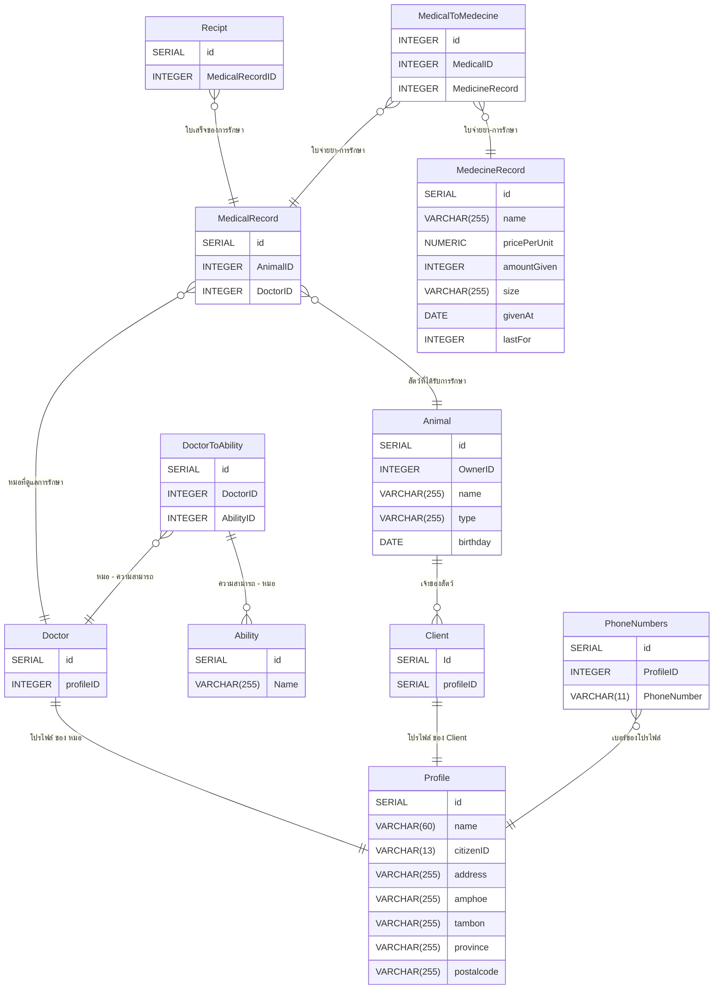

# Week 3

## โจทย์
เจ้าของสัตว์มีเบอร์โทร **ได้หลาย** เบอร์\
และมีที่อยู่ที่ **ต้อง** ทำรายงานรายเขตได้\
เจ้าของหนึ่งคนพาสัตว์มาได้ **หลายตัว** แต่สัตว์ทุกตัว**ต้องมีเจ้าของ**\
สัตว์มี**วันเกิด**และระบบต้องแสดงอายุได้\
การเข้ารับบริการนับเป็น “ครั้งที่ 1, 2, 3...” **ของสัตว์แต่ละตัว**\
แต่ละครั้งมี**สัตวแพทย์ผู้ตรวจหนึ่งคน**และ**ต้องระบุเสมอ**\
สัตวแพทย์มี**ความเชี่ยวชาญได้หลายด้าน**\
การเข้ารับบริการหนึ่งครั้ง**จ่ายยาได้หลายรายการ หรือไม่จ่ายเลยก็ได้** แต่ละรายการระบุขนาดยาและจำนวนวัน\
**เมื่อออกใบเสร็จและรับเงินแล้ว ยอดที่พิมพ์ไปต้องไม่เปลี่ยนอีก**

## Solution

- [Table Structure](#table-structure)
	- [Profile](#profile)
	- [PhoneNumbers](#phonenumbers)
	- [Client](#client)
	- [Animal](#animal)
	- [Doctor](#doctor)
	- [DoctorToAbility](#doctortoability)
	- [Ability](#ability)
	- [MedicalRecord](#medicalrecord)
	- [MedecineRecord](#medecinerecord)
	- [Recipt](#recipt)
	- [ReciptToMedecineRecord](#recipttomedecinerecord)
- [Relationships](#relationships)

## Table structure

### Profile

| Name           | Type         | Settings        | References | Note |
| -------------- | ------------ | --------------- | ---------- | ---- |
| **id**         | SERIAL       | 🔑 PK, not null |            |      |
| **name**       | VARCHAR(60)  | not null        |            |      |
| **citizenID**  | VARCHAR(13)  | not null        |            |      |
| **address**    | VARCHAR(255) | not null        |            |      |
| **amphoe**     | VARCHAR(255) | not null        |            |      |
| **tambon**     | VARCHAR(255) | not null        |            |      |
| **province**   | VARCHAR(255) | not null        |            |      |
| **postalcode** | VARCHAR(255) | not null        |            |      | 

ตาราง `Profile` สร้างขึ้นเพื่อเก็บข้อมูลของ ลูกค้า หรือ หมอ\
ชื่ออาจจะเป็น 1 Attribute (Simple) หรือ 2 Atrribute (Composite) ก็ได้\
และเก็บข้อมูลที่อยู่เพื่อทำรายงาน และข้อมูลทุกตัวไม่ควรมีค่าว่าง

### PhoneNumbers

| Name            | Type        | Settings        | References      | Note |
| --------------- | ----------- | --------------- | --------------- | ---- |
| **id**          | SERIAL      | 🔑 PK, not null |                 |      |
| **ProfileID**   | INTEGER     | not null        | เบอร์ของโปรไฟล์ |      |
| **PhoneNumber** | VARCHAR(11) | not null        |                 |      | 

ตาราง `PhoneNumbers` เก็บข้อมูลเบอร์โทรของแต่ละ `Profile` เพื่อเพิ่ม/ลบ/แก้ไข เบอร์ของแต่ละโปรไฟล์

### Client

| Name          | Type   | Settings         | References         | Note |
| ------------- | ------ | ---------------- | ------------------ | ---- |
| **Id**        | SERIAL | 🔑 PK, not null  |                    |      |
| **profileID** | SERIAL | not null, unique | โปรไฟล์ ของ Client |      | 

ตาราง `Client` สร้างมาเพื่อเก็บข้อมูลลูกค้า โดยมี Relation กับ `Profile` แบบ 1-1

### Animal

| Name         | Type         | Settings        | References   | Note |
| ------------ | ------------ | --------------- | ------------ | ---- |
| **id**       | SERIAL       | 🔑 PK, not null |              |      |
| **OwnerID**  | INTEGER      | not null        | เจ้าของสัตว์    |      |
| **name**     | VARCHAR(255) | null            |              |      |
| **type**     | VARCHAR(255) | not null        |              |      |
| **birthday** | DATE         | not null        |              |      | 

ตาราง `Animal` สร้างเพื่อเก็บข้อมูลสัตว์ และ เก็บข้อมูลวันเกิด เพื่อนำไปคำนวณ อายุ ใน Application Logic\
แต่เราอาาจะไม่มีชื่อของสัตว์เลี้่ยง เลยอาจจะเป็นค่าว่างได้

### Doctor

| Name          | Type    | Settings        | References      | Note |
| ------------- | ------- | --------------- | --------------- | ---- |
| **id**        | SERIAL  | 🔑 PK, not null |                 |      |
| **profileID** | INTEGER | not null        | โปรไฟล์ ของ หมอ |      | 

ตาราง `Doctor` เก็บข้อมูลหมู และมี Relation ไปที่ โปรไฟล์หมอ
และมี Relation ไปที่ตาราง `DoctorToAbility` แบบ M-M

### DoctorToAbility

| Name          | Type    | Settings        | References       | Note |
| ------------- | ------- | --------------- | ---------------- | ---- |
| **id**        | SERIAL  | 🔑 PK, not null |                  |      |
| **DoctorID**  | INTEGER | not null        | หมอ - ความสามารถ |      |
| **AbilityID** | INTEGER | not null        | ความสามารถ - หมอ |      | 

ตาราง `DoctorToAbility` เป็นตารางเชื่อม / Entity อ่อน ระหว่าง

### Ability

| Name     | Type         | Settings        | References       | Note |
| -------- | ------------ | --------------- | ---------------- | ---- |
| **id**   | SERIAL       | 🔑 PK, not null |									 |      |
| **Name** | VARCHAR(255) | not null        |                  |      | 

ตาราง `Ability` เป็นตารางเก็บความสามารถหมอ ในที่นี้ ให้ว่ามีแค่ชื่อ

### MedicalRecord

| Name         | Type    | Settings        | References             | Note |
| ------------ | ------- | --------------- | ---------------------- | ---- |
| **id**       | SERIAL  | 🔑 PK, not null |                        |      |
| **AnimalID** | INTEGER | not null        | สัตว์ที่ได้รับการรักษา |      |
| **DoctorID** | INTEGER | not null        | หมอที่ดูแลการรักษา     |      | 

ตาราง `MedicalRecord` เป็นตารางเก็บข้อมูลการรักษา โดยมี ข้อมูลคร่าวๆ คือ AnimalID DoctorID\
Relations ที่มีในคือ
- ใน 1 การรักษาจะต้องมีสัตว์ให้รักษา 1 ตัว และไม่สามารถไม่มีได้
- ใน 1 การักษาจะต้องมีหมอ 1 คนมารักษา และไม่สามารถไม่มีได้
- ใน 1 การรักษาจะผูกกับ 0-N การจ่ายยา

### Recipt

| Name                | Type    | Settings        | References         | Note |
| ------------------- | ------- | --------------- | ------------------ | ---- |
| **id**              | SERIAL  | 🔑 PK, not null |                    |      |
| **MedicalRecordID** | INTEGER | not null        | ใบเสร็จของการรักษา |      | 

ตาราง `Recipt` เป็นตารางเก็บข้อมูลการจ่ายเงิน โดยมี MedicalRecordID\
และ Relation ที่มี คือ 1 การรักษา 1 ใบเสร็จ\
และจะให้ Application คำนวณราคาแทน เพื่อไม่ให้เกิดปัญหาข้อมูลที่ทับซ้่อน

### MedicalToMedecine

| Name               | Type    | Settings                       | References        | Note |
| ------------------ | ------- | ------------------------------ | ----------------- | ---- |
| **id**             | INTEGER | 🔑 PK, not null, autoincrement |                   |      |
| **MedicalID**      | INTEGER | not null                       | ใบจ่ายยา-การรักษา |      |
| **MedicineRecord** | INTEGER | not null                       | ใบจ่ายยา-การรักษา |      | 

ตาราง `MedicalToMedecine` เป็นตารางเชื่อม MedicalRecord กับ MedecineRecord หรือเป็น Entity อ่อน

### MedecineRecord

| Name             | Type         | Settings        | References | Note |
| ---------------- | ------------ | --------------- | ---------- | ---- |
| **id**           | SERIAL       | 🔑 PK, not null |            |      |
| **name**         | VARCHAR(255) | not null        |            |      |
| **pricePerUnit** | NUMERIC      | not null        |            |      |
| **amountGiven**  | INTEGER      | not null        |            |      |
| **size**         | VARCHAR(255) | not null        |            |      |
| **givenAt**      | DATE         | not null        |            |      |
| **lastFor**      | INTEGER      | not null        |            |      | 

ตาราง `MedecineRecord` เก็บข้อมูลยาที่จ่าย ชื่อยา, ราคาต่อหน่อย, จำนวนที่จ่าย, ขนาด, จ่ายเมื่อ, จำนวนวันของยาที่ให้\
ปัญหาคือ column lastFor อาจจะเก็บ lastFor เป็นวัน ที่บวกเพิ่มเข้าไปอีก 3 วัน จากวันที่จ่าย แล้วคำนวณจาก Application ว่ายานั้นใข้ได้กี่วันก็ได้ 

## Relationships

- **MedicalRecord to Animal**: many_to_one
- **DoctorToAbility to Ability**: one_to_many
- **DoctorToAbility to Doctor**: many_to_one
- **MedicalRecord to Doctor**: many_to_one
- **MedicalToMedecine to MedecineRecord**: many_to_one
- **Recipt to MedicalRecord**: many_to_one
- **Animal to Client**: one_to_many
- **Client to Profile**: one_to_one
- **PhoneNumbers to Profile**: many_to_one
- **Doctor to Profile**: one_to_one
- **MedicalToMedecine to MedicalRecord**: many_to_one